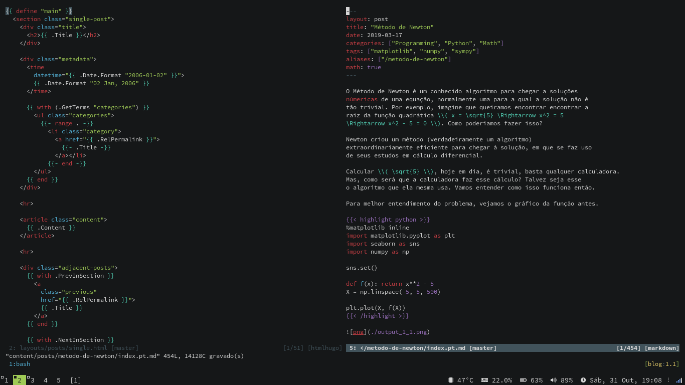

# Hugo development support in Vim

This a Vim plugin to better support doing web development with Hugo.

It improves syntax highlighting, indentation and a bunch of other things (such
as comments, matchit pairs, `:h path` etc.).

There is also a compiler plugin that you can use, for example `:compiler hugo |
make`.

